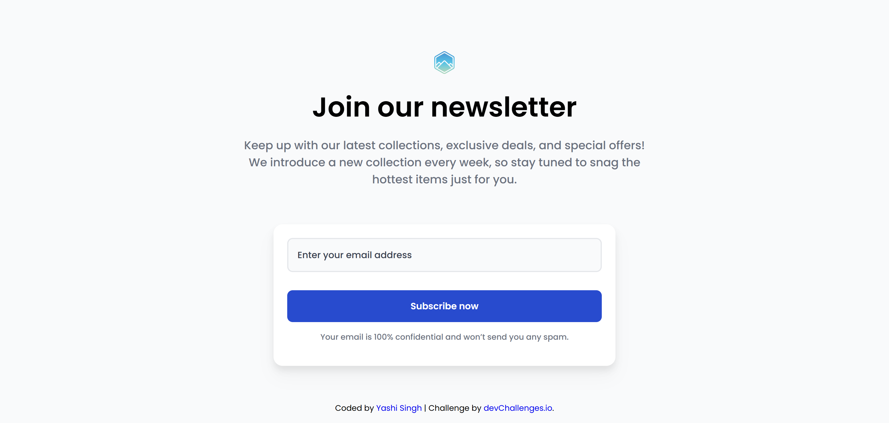
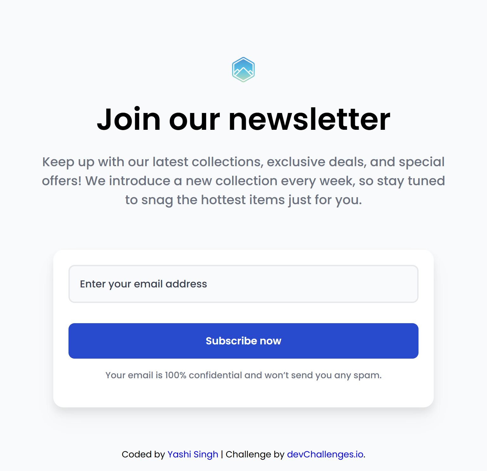
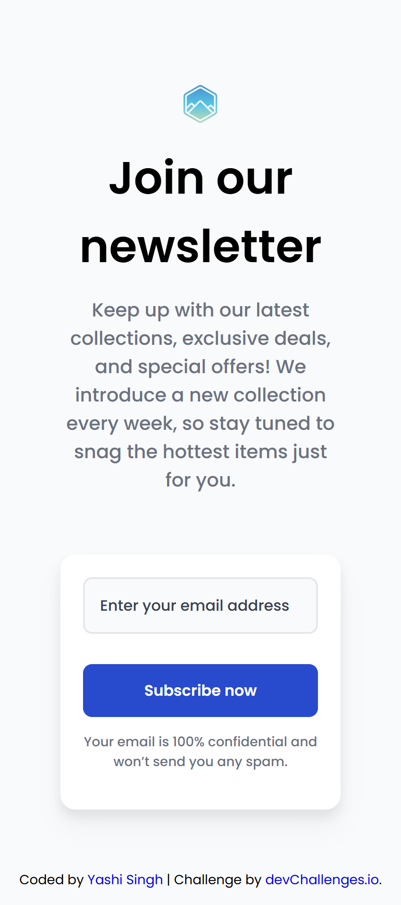

<h1 align="center">Join Our Newsletter | devChallenges</h1>

<div align="center">
   Solution for a challenge <a href="https://devchallenges.io/challenge/join-our-newsletter" target="_blank">Join Our Newsletter</a> from <a href="https://devchallenges.io/" target="_blank">devChallenges.io</a>.
</div>

<div align="center">
  <h3>
    <a href="https://yashi-singh-9.github.io/Join-Our-Newsletter/" target="_blank">
      Demo
    </a>
    <span> | </span>
    <a href="https://devchallenges.io/solution/50766" target="_blank">
      Solution
    </a>
    <span> | </span>
    <a href="https://devchallenges.io/challenge/join-our-newsletter" target="_blank">
      Challenge
    </a>
  </h3>
</div>

---

## 📌 Table of Contents

* [Overview](#overview)
  * [What I Learned](#what-i-learned)
  * [Useful Resources](#useful-resources)
* [Project Structure](#project-structure)
* [Built With](#built-with)
* [Features](#features)
* [Screenshot](#screenshot)
* [Getting Started](#getting-started)
* [Contact](#contact)
* [Acknowledgements](#acknowledgements)

---

## 🚀 Overview

This project is a solution to the [Join Our Newsletter](https://devchallenges.io/challenge/join-our-newsletter) challenge on DevChallenges.io. The goal was to build a responsive newsletter sign-up form based on a provided design, practicing HTML and CSS fundamentals with an emphasis on layout, responsiveness, and user experience.

---

### ✅ What I Learned

* How to structure semantic HTML5 markup.
* Responsive web design using Flexbox and media queries.
* Best practices for form styling and accessibility.
* Using utility-first frameworks and Bootstrap to speed up development.
* Hosting and deploying a project with Vercel/GitHub Pages/Netlify.

---

### 📚 Useful Resources

* [CSS Tricks - Flexbox Guide](https://css-tricks.com/snippets/css/a-guide-to-flexbox/) – A go-to reference for layout design.
* [Google Fonts](https://fonts.google.com/) – For integrating beautiful, performant fonts.
* [Bootstrap 5](https://getbootstrap.com/docs/5.3/getting-started/introduction/) – Responsive and flexible front-end components.

---

## 📁 Project Structure

```
Join-Our-Newsletter/
├── index.html
├── README.md
├── design/
│   ├── desktop-design.png
│   ├── tablet-design.png
│   └── mobile-design.png
├── resources/
│   ├── images/
│   │   ├── favicon.ico
│   │   └── logo.svg
│   ├── style/
│   │   └── style.css
│   └── script/
│       └── script.js
```

---

## 🛠 Built With

* Semantic HTML5 markup
* CSS custom properties
* [Bootstrap 5](https://getbootstrap.com/) – For layout, spacing, and responsiveness
* [Google Fonts - Poppins](https://fonts.google.com/specimen/Poppins)

---

## ✨ Features

* ✅ Responsive newsletter subscription form
* ✅ Validates required email input
* ✅ Styled error and success states
* ✅ Clean, modern layout using Bootstrap and custom styles
* ✅ Deployed and accessible via a live demo link

This site was created as part of a [DevChallenges](https://devchallenges.io/) frontend practice challenge.

---

## 📷 Screenshot

**Desktop Design**  


**Tablet Design**  


**Mobile Design**  


--- 

## 🚀 Getting Started

To run this project locally:

```bash
git clone https://github.com/Yashi-Singh-9/Join-Our-Newsletter.git
cd Join-Our-Newsletter
open index.html
````

Or simply open `index.html` in your browser after cloning.

---

## 🤝 Acknowledgements

* [DevChallenges.io](https://devchallenges.io/) for the challenge
* [Font Awesome](https://fontawesome.com/) – If icons are used
* [GitHub Pages Docs](https://pages.github.com/) – For project deployment
* [Bootstrap](https://getbootstrap.com/) – For layout and utilities

---

## 🧑‍💻 Contact

* LinkedIn: [Yashi Singh](https://www.linkedin.com/in/yashi-singh-b4143a246)

---

⭐ Feel free to star this repo or share it if you found it helpful!
